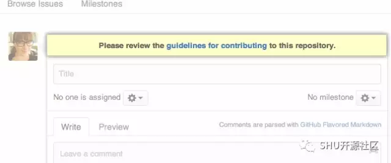

> 注：这篇文章是开源社区翻译的开源指南 [opensource.guide](http://opencource.guide) 系列的第二篇文章，原文链接在微信中无法点击，请点击阅读原文在原文中查看。
>
> 译者：cosformula （<del>我永远喜欢珂朵莉！</del>）

<!-- more -->

## 开源：是什么，为什么

### 开源意味着什么

> 你点开了这篇文章， 说明你可能在打算入开源的坑。
>
> 这其实是一件很值得高兴的事情，因为世界又因你做出的贡献而变得更美好了一点点。
>
> 今天我们来要说的内容是，什么是开源以及为什么人们要开源。

当一个项目被开源以后，任何人都可以出于任何目获得查看，使用，修改，分发这个项目。 这些权限由指定的开源协议许可执行。

开源的伟大之处在于降低了采用技术的门槛，从而使各种各样的创意都能够快速传播。

要理解开源是怎么样一个过程，我们可以用一个例子来说明。先假设你有一个朋友在家里开聚会，大家都带着自己做好的食物去参加，而你带了自己做的包子。

+ 大家都吃了你的包子 **使用**

+ 耶，他们觉得你的包子超级好吃！ 然后全都过来问你包子是怎么做的，你把做包子的菜谱给他们看 *查看*
+ 然后你还有一个很厉害的厨师朋友，他也觉得你的包子不错，但是他说你的香菜放多了建议你少放一点 — *修改*
+ 你的另一个朋友想用你的菜谱做包子当晚饭，你没理由不答应 — *分发*

如果说上述的情景可以说是开源的话，简单地做一个比较，一个闭源的项目就好像一个包子铺。你必须付钱才能买到包子吃，并且很可能他们不告诉你包子是怎么做的，因为也许他们认为那是商业机密。 

但如果你试着模仿做出来了一模一样的包子，并且新开了一家店也卖这个包子，那包子铺可以上法院告你。

### 为什么大家要将自己的项目开源？

>  我在开源过程中得到的最珍贵的体验就是，和其他的开发者建立的患难与共的关系。
>
>  **— @kentcdodds** （）

一个人或一个组织决定将他们的项目开源有[许许多多的原因](https://ben.balter.com/2015/11/23/why-open-source/)，简单举例如下：

- 团队协作： 开源项目可以接受来自世界各地的任何人的贡献，例如，[Exercism](https://github.com/exercism/)，是一个有超过 350 名贡献者的编程培训平台。
- 再创作： 由于开源项目可以由任何人出于任何目的使用，我们也可以用它来构建别的东西。比如你应该听说过 [WordPress](https://github.com/WordPress) 的大名，但最初的时候，它是从一个叫做 [b2](https://github.com/WordPress/book/blob/master/Content/Part%201/2-b2-cafelog.md) 的开源项目衍生而来的。
- 公开透明： 任何人都可以查看某个开源项目，审查这个项目的代码是否有不合理的地方。透明性对于某些政府比如 [保加利亚](https://medium.com/@bozhobg/bulgaria-got-a-law-requiring-open-source-98bf626cf70a) 和 [美国](https://sourcecode.cio.gov/)，像银行业或医疗保健业这样的监管行业，还有类似于 [Let's Encrypt](https://github.com/letsencrypt) 的安全软件都很重要。

开源并不仅仅是针对软件而言，实际上从数据集到电子书都可以开源。你可以在 [GitHub Explore](https://github.com/explore) 看一下还有哪些东西可以开源。

### 开源意味着免费使用吗？

开源最大吸引力就是不需要花钱。但是其实，免费使用只是开源价值观的一个副产品。

由于 [开源协议所约定](https://opensource.org/osd-annotated) 的那样，任何人都可以出于任何目的使用／修改／分发你的开源项目，项目本身往往是可以免费使用的。如果一个开源项目需要付钱才能使用，那么任何人都可以合法的获取一份开源项目的拷贝并且使用免费的版本。

因此，绝大部分的开源项目都是免费使用的，但免费并不是开源定义的一部分。还是有许多种方式可以间接地向开源项目收费，比如双许可证模式和限制某些功能的使用，而这依然遵循开源的定义

## 我应该开始做自己的开源项目吗？

> 一个字，是的。
>
> 因为，无论最终结果如何，实践出真知。
>
> 开发一个属于你自己的开源项目都是学习开源工作的好办法。

如果你在之前从未有过任何开源项目，你可能会在意别人怎么评价你的项目，又或者担心其实根本没人在意你的项目。如果你在担心的是这个，没关系，其实大家一开始都是这样的。

开源工作与任何其他的创造活动都类似，比如写作或是绘画，最开始的时候你会害怕把你的作品给别人看，但是实践才是变好的唯一途径——哪怕根本没有人在看。

如果你还没有被说服，我们还可以讨论一下你可能在开源过程中达成的目标。

### 定好目标

有了目标你才能知道什么事情要做，什么事情不要做，以及在哪些方面需要别人的帮助。先自己想一下，*为什么我要将这个项目开源*？

这个问题，没有确切的答案。在一个项目里你可能会有多个目标要实现，又或者，在不同的项目里其实你追求的是同一个东西。

如果你开源的唯一目的就是炫耀你的代码有多棒，你可能不会想要别人参与贡献进来，甚至你会在 **README** 里直接告诉别人不要改你的代码。

但是，如果你想要别人继续改进这个项目，你就要花点时间来写清楚文档，让新参与到这个项目中来的人能够快速熟悉整个项目。

> 还记得某天我做了一个自定义UI警告视图，一开始只是给自己用...但是我决定把它开源。
>
> 所以我把这个项目做了少许修改，然后上传到了GitHub。
>
> 后来还写了我人生中第一个文档，来告诉别的开发者，他们应该怎么在项目里使用这个东西。
>
> 也许其实根本没有人会在他们的项目中用到这个，因为这个项目其实很简单，但是我依然为我做出的这一点贡献而开心。
>
> **— @mavris**

你的项目可能会进一步发展壮大，你的社区除了需要你写的代码以外，也还有很多别的很重要的工作需要你来处理，比如响应问题，审查代码，推广你的项目什么的。

在这些非代码的任务上花费的时间根据项目的不同而不同，你应该准备好找一个人来维护这个项目，最好是你自己，如果感觉自己精力有限的话也可以试试找个人来帮你。

**如果你是一个公司开源项目的成员**， 请确保你的项目在公司能够得到足够的内部资源来保障它的成长。在发布后你需要确定谁负责这个项目的维护，以及你们怎么同来自开源社区的其他人共享任务。

除此之外，如果你需要预算或员工来升级，运营，维护这个项目，那么请尽早做好准备。

### 为其他的项目作出贡献

如果你的目标只是学会如何与他人协作，或是理解开源的工作流程，请考虑为已有的项目作出贡献。可以从维护一个你已经在使用并且热爱的开源项目开始。其实完全可以从一些简单的工作开始，比如纠正拼写错误或者更新项目文档。

如果你还不确定如何开始成为一个开源项目的贡献者，请查看我们翻译的

[开源指南（一）— 如何参与贡献。](/p/fd537cdf.html)

## 开启你自己的开源项目

> 你可以在任何阶段开源你的项目，哪怕还没有开始做，仅仅是一个想法，又或者是正在开发中，还可以是闭源数年后再开源。

一般来讲，一旦你认为你的项目能够接受来自外界的审视和反馈，那就可以将你的项目开源了。

不过，不管你决定在哪个阶段将你的项目开源，你的项目都应该包括如下的几个文档：

- **Open source license**（[开源协议](https://help.github.com/articles/open-source-licensing/#where-does-the-license-live-on-my-repository)）
- **README** （[自述文档](https://help.github.com/articles/create-a-repo/#commit-your-first-change)）
- **Contributing guidelines **（[贡献指南](https://help.github.com/articles/setting-guidelines-for-repository-contributors/)）
- **Code of conduct**（[行为准则](https://opensource.guide/code-of-conduct/)）

作为一个维护者，这些文档将有助于你们交流想法，管理贡献，保护每个人的合法权利（当然也包括你的）。这些文档可以显著地提升你在开源过程中的体验。

如果你的项目托管在 [GitHub](https://github.com/) 上，将这些文件放在根目录下，然后使用指定的名字命名文件，[GitHub](https://github.com/) 就会自动的识别出来这些文件然后展现给来访者 （比如**README**）。

### 选择一份开源协议

一个开源协议保证了其他人可以使用／拷贝／修改／分发你的项目而不需要考虑任何后果。

选择开源协议可以让你免于处理一些麻烦的法律纠纷。**你必须在开始开源项目时选择一份开源协议。**

这些法律有关的东西一点也不好玩。但是还好，现在你可以简单地将已有的协议文本拷贝到你的代码仓库中。实际操作起来只需要不到一分钟。

[MIT](https://choosealicense.com/licenses/mit/) [Apache 2.0](https://choosealicense.com/licenses/apache-2.0/)以及 [GPLv3](https://choosealicense.com/licenses/gpl-3.0/) 是最有名的几个开源协议，但是你也可以[选个不一样的](https://choosealicense.com/)。

方便的是，当你在GitHub中创建一个新项目时，有个选项可以让你直接选择一个开源协议。

如果你对于管理开源项目还有法律方面的问题，可以等待这系列后续的文章。

### 写好自述文件**（README）**

README不仅仅是告诉别人这个项目应该如何使用。它还能解释你的项目的重要性，以及大家可以用它来做什么。

如果你不知道怎么写，在你的README文件中试着回答以下的问题。

- 这个项目是做什么的？
- 这个项目为什么有用？
- 我该怎么用这个项目？
- 如果我对这个项目有疑问的话，该找谁？

你也可以在**README**写更详细的信息，比如你会怎么处理别人贡献的代码，你的项目旨在实现什么目的，以及项目的许可证和归属问题等等。

如果你不想接受别人贡献的代码，又或者是你的项目还没有准备好在生产环境中使用，最好也在文件里说明一下。

> 文档写的越好，用的人就越多，向你问问题的人也就越少，而参与到这个项目中的人也会越多。需要时刻谨记，你的读者不像你一样了熟悉这个项目，他们刚看到这个项目的时候和你是完全不同的感觉。
>
> **— @limedaring**

有些时候，大家不想写README，因为他们可能认为这个项目还是未完成状态状态，又或者是他们不想要别人的参与。

这里还有一些关于README怎么写的资料，比如 ["Making READMEs Readable"](https://pages.18f.gov/open-source-guide/making-readmes-readable/) 或者 [@PurpleBooth](https://github.com/PurpleBooth) 写的[README template](https://gist.github.com/PurpleBooth/109311bb0361f32d87a2)

把 **README** 文件放在在你项目的根目录里，GitHub 就会自动地将它显示到你代码仓库的主页中。

### 编写你的贡献指南**（CONTRIBUTING）**

**CONTRIBUTING**文件告诉大家，该如何参与到这个项目中来，例如可能会有如下信息：

- 如何提交错误报告
- 如何提出新的功能
- 如何搭设开发环境，如何运行代码测试

除了技术性的细节，**CONTRIBUTING** 文档中还可以写明你对代码贡献的期望，例如：

- 想要接受的贡献类型
- 你项目的版本路线图和愿景
- 贡献者应不应该与你取得联系

用**温柔，友好**的语气，对其他人要提交的贡献提出确切的建议（例如写文档，做一个项目网站），做好这些事情可以让你的项目走的更加长远，并且让新参与进来的人宾至如归，充满了参与这个项目的信心。

例如，开源项目 [Active Admin](https://github.com/activeadmin/activeadmin/) 的 [**CONTRIBUTING **](https://github.com/activeadmin/activeadmin/blob/master/CONTRIBUTING.md) 文档用这句话开头

> **首先，感谢您正在考虑为Active Admin项目贡献您的力量。**
>
> **正是像您一样的人才使得Active Admin成为一个这么棒的工具软件。**

在项目的早期阶段，你的 **CONTRIBUTING** 文件可能十分简单。但是里面总应该包含有关于如何报告错误或保存 issues 的说明，以及在别人参与开发时的技术性的要求（比如软件测试）。

渐渐的，你可能会向你的 **CONTRIBUTING** 文件添加一些 FAQ*（frequently asked questions，频繁被问及的问题）*。将这些东西明确地写到文档中，就不会有人因为这些常见问题来经常问你了。

同样的，这里还有一些关于 **CONTRIBUTING** 怎么写的资料，可以看看 @nayafia 的 [contributing guide template]() 或者 @mozilla 出品的 ["How to Build a CONTRIBUTING.md"](https://mozillascience.github.io/working-open-workshop/contributing/)

### 设立行为准则**（CODE_OF_CONDUCT）**

> 我们都有过这样的经历，要么是作为维护者的身份去解释为什么这里要这么做，又或者是作为一个用户，去问了一个简单的问题...
>
> 但一旦行为准则变成了一个容易引用和可链接的文件，那么就说明你的团队开始注重一些更有意义的对话。
>
> **— @****mlynch**

最后，一份行为准则对你项目的参与者作出一系列的规定。行为准则非常有意义，尤其是在为了某个社区或公司在进行一项开源项目的时候。一份行为准则可以促进社区建设，帮助社区健康成长，这些都会减少你作为维护者的压力。关于行为准则更多的信息，请关注我们后续的推送。

除了向社区成员传达你对他们的期望，行为准则也倾向于描述这些期望是用于何种情况，何时适用，以及如果发生违规行为怎么处理。

和开源协议一样，行为准则也有一些现成的版本，如果你需要的话也不需要你自己来撰写。

例如 [Contributor Covenant](https://contributor-covenant.org/) 就是一个现成的行为准则，有[超过四万个开源项目](http://contributor-covenant.org/adopters/) 在用这个，其中还有一些很著名的项目比如Kubernetes, Rails, 以及 Swift。

同样的，把文本直接粘贴 **CODE_OF_CONDUCT** 文件里，然后放置在根目录下方便大家看到，然后最好 **README** 里加上这个文件的链接。

## 起个好名字，打好品牌

> 品牌不只是一个炫酷的logo或者是一个吸引人的项目名。
>
> 而更是关于你如何看待这个项目，以及你想要将这个信息传达给谁。

### 挑个好名字

选一个容易记住的名字，理想情况下，最好和项目本身做的事情相关，比如这两个例子：

- [Sentry](https://github.com/getsentry/sentry) ，在英文中是哨兵的意思，这个项目用来监测报告 APP 崩溃情况
- [Thin](https://github.com/macournoyer/thin) ，英文意思不用多讲了，Thin 是一个快速简单的 Ruby web 服务器，用 Thin 做名字很好的说明了这个服务器的特点。

如果你是在已有的项目基础上开发的项目，使用那个项目的名字作为前缀，可以让人清楚的知道这一点。*（例如 [node-fetch](https://github.com/bitinn/node-fetch) 是一个在 Node.js 上实现 `window.fetch` 的项目）*

但是，最优先选择一个清晰明了的名字。使用双关语是很有意思，但是记住，有些名字的含义可能会不能准确的让每个人都理解，因为大家有着不同的文化或语言背景。你的一些用户可能是在公司里使用你的项目，如果你起了一些容易引起歧义或争议让人有不好联想的名字，那么他们在解释你项目的名字可能会很尴尬，而你应该不希望看到这点。

### 避免重名

你可以在 [ivantomic.com](http://ivantomic.com/projects/ospnc/) 事先查一下和你的开源项目有着相似名字的项目，尤其是你们使用同一种语言开发，或者是处于同一环境的生态系统的相似工具。除此之外，如果你选择的名字与另一个已经广受欢迎的项目重名，你也许会误导你的用户。

如果你想要搭一个网站，开一个微博账号，或者是其他的什么东西来代表你的项目官方，请确保你能申请到你想要的名字。

确保你的项目命名不与现有的任何商标冲突。不然的话，以后可能会有公司来让你撤下你的项目，甚至有可能采取法律手段。不值得为这种事情冒风险。

你可以在 [WIPO Global Brand Database](http://www.wipo.int/branddb/en/) 查一查有没有商标冲突。如果你在公司里，贵公司的法务部门可以帮你解决一些问题，可以在开源指南的另一篇文章里查看。

最后，把你 Google 一下你选好的项目名。看一下大家是不是能方便地根据项目名找到你的项目，以及，和你项目在同一页的搜索结果里是否有你不希望用户看到的东西。

#### 你写文档和敲代码的风格也影响着你的品牌

在你项目的整个生命周期中。你会写好多好多的文档，**README**，教程，社区文档，回复 **issues**，甚至是业务通讯和邮件列表。

但无论是官方的文档还是随便一封邮件，你的写作风格其实也是你项目品牌的一个特点。所以在写作之前想一下，假设你偶然遇到了你的关注你项目的人，你现在使用的语气是否是你想要传达给他的

> 我努力参与到了每一条邮件列表，成为了别人眼中的社区楷模。
>
> 对人友好，认真地对待大家提出的issues，努力尝试去帮助大家。
>
> 在一段时间之后，大家不仅仅是带着提问来，他们开始试着帮助回答其他人提出的问题。
>
> 最让我欣慰的是，他们回答时，模仿的是我的回答的风格。
>
> **— @kentcdodds**

使用温柔的语气以及复数的指示代词*（例如，就算只有一个人，也要用“他们”而不是他）*，这样的说话风格能让新的贡献者感受到你的友好。此外，坚持使用简单明了的词汇，因为你的用户的母语很可能不是英语。

在如何斟酌词汇之外，你的编程风格亦是你项目品牌的一个重要组成部分。[Angular](https://github.com/johnpapa/angular-styleguide) 以及 [jQuery](https://contribute.jquery.org/style-guide/js/) 就是是两个有着严格的代码风格和指导说明的两个例子。

在刚开始的时候，并不一定需要有一个指导书来指明这个项目的代码风格，而且反正你会发现，不管怎么样你的项目里总会有着不同的代码风格会搅合在一起。

但你应当知道，你的写作和编程风格会吸引喜欢你的风格的人参与进来，同时也会劝退不喜欢你的风格的人。

也就是说，如果你的项目已经有了自己的风格，那么新加入的成员的写作与代码风格很大程度上是与已有的风格重叠的。

因此，最好在项目的早期阶段就建立好良好的写作和代码风格，为后参与进来的人有先例可循，这样你的项目就能获得风格一致性。

## 恭喜！

现在，可以开始开源你的第一个项目了。不论最终结果如何，为公众工作都是对开源社区的一份礼物。

任何一次 **commit**，任何一行注释，任何一个 **pull request**，都是在为你和他人创造学习和成长的机会。

